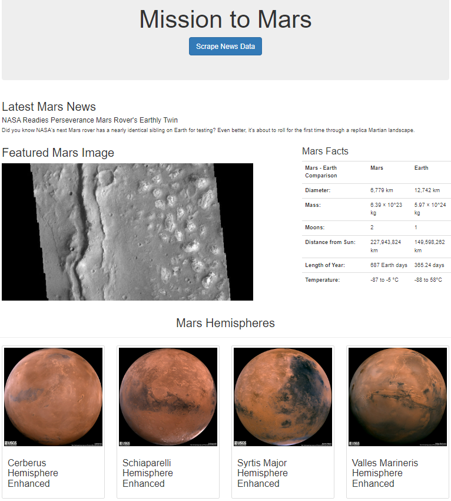

# Module 12 - Web Scraping Challenge
## Summary

In this assignment, I built a web application that scrapes various websites for data related to a Mission to Mars and displayed the information in a single HTML page.  
- The site contains:
  - a responsive home page with a button to collect data
  - information scraped from 4 different websites and stored in Mongo DB

- Key technologies include:
  - BootStrap js library
  - Cascading Style Sheets CSS
  - Jupyter Notebook with Pandas
  - BeautifulSoup library
  - Splinter library
  - Mongo DB
  - Flask

# 

- References
  - [redplanetscience.com](https://redplanetscience.com/). (2022). Сurrent headlines. Retrieved from https://redplanetscience.com
  - [spaceimages-mars.com](https://spaceimages-mars.com/). (2022). Mars image. Retrieved from https://spaceimages-mars.com  
  - [galaxyfacts-mars.com](https://galaxyfacts-mars.com/). (2022). Mars facts. Retrieved from https://galaxyfacts-mars.com
  - [marshemispheres.com](https://marshemispheres.com/). (2022). Astrogeology site. Retrieved from https://marshemispheres.com

